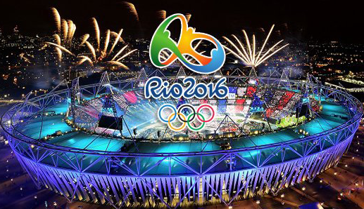
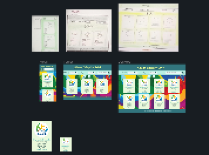
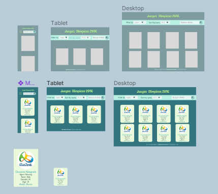
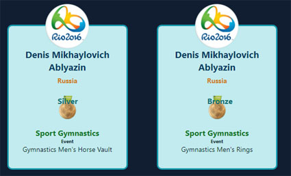

# Olympic Games

## Índice

* [1. Preámbulo](#1-preámbulo)
* [2. Resumen del proyecto](#2-resumen-del-proyecto)
* [3. Necesidades de los usuarios](#3-necesidades-de-los-usuarios)
* [4. Funcionalidades](#4-funcionalidades-funcionalidades)
* [5. Consideraciones generales](#5-consideraciones-generales)
* [6. Criterios de diseño](#6-Criterios-de-diseño)

***

## 1. Preámbulo

Según [Olympics](https://olympics.com/es/olympic-games), Los Juegos Olímpicos son la única competición verdaderamente global, multideportiva y que celebra el deporte en el mundo. Con más de 200 países que participan en más de 400 eventos entre los Juegos de Verano y de Invierno, los Juegos son donde todo el mundo acude a competir, a inspirarse y a estar juntos.

Los Juegos Olímpicos de Río de Janeiro 2016, fue un evento multideportivo internacional, celebrado en la ciudad de Río de Janeiro, Brasil, entre el 5 y el 21 de agosto de 2016, aunque la fase de grupos del torneo de fútbol comenzó el 3 de agosto en la rama femenina y el 4 de agosto en la rama masculina. También se realizaron en dicha ciudad los XV Juegos Paralímpicos, entre el 7 y el 18 de septiembre del mismo año.

En esta edición de los Juegos Olímpicos participaron 11.551 atletas de 207 comités olímpicos nacionales (Kosovo y Sudán del Sur participaron por primera vez). Las competiciones se llevaron a cabo en 33 recintos deportivos de cuatro barrios de Río de Janeiro (Maracaná, Barra da Tijuca, Deodoro y Copacabana) y en cinco estadios ubicados en las ciudades de São Paulo, Belo Horizonte, Salvador de Bahía, Brasilia y Manaos.

La elección de Río marcó la primera vez en que Brasil ha sido designado como sede de los Juegos Olímpicos. Además, es la primera vez que se realiza en un país sudamericano, la segunda en un país de Latinoamérica (la primera edición fue México 1968).

## 2. Resumen del proyecto

Juegos Olímpicos de Río de Janeiro, fueron un evento multideportivo internacional, celebrado en la ciudad de Río de Janeiro, Brasil. La elección de Río marcó la primera vez que se realiza en un país sudamericano. Este evento tuvo gran acogida a nivel mundial, de todas estas personas hay un grupo que desea poder interactuar y ver la información de los atletas, los deportes olímpicos y los países que participaron.

## 3. Necesidades de los usuarios
Para entender mejor qué información que podrían necesitar nuestros usuarios, hicimos una rápida investigación (research) y estos son algunos de los hallazgos.

* Información relevante sobre los atletas olímpicos, como nombre, país que representa y especialidad deportiva.
* En los juegos olímpicos son muchos los países participantes, para nuestros usuarios es importante saber cuáles son.
* Adicionalmente a esta información, para nuestros usuarios es importante poder ver el promedio de la edad de los atletas que participaron.
* En los juegos olímpicos hay deportes y estos tienen sus disciplinas, para nuestros usuarios es importante saber cuáles son.
* En los juegos olímpicos siempre hay equipos o atletas que ganan diferentes disciplinas, para nuestros usuarios es importante saber quiénes son y que medallas ganaron.
* Es importante para nuestros usuarios ver la información de cada atleta organizada de manera ascendente y descendente.
* Adicionalmente a nuestros usuarios les gustaría saber la cantidad de mujeres atletas que participaron y ganaron medallas.

## 4. Funcionalidades

El objetivo principal de este proyecto es mostrar la data de los atletas que participaron y ganaron medallas en los Juegos Olimpicos de Rio 2016, visualizando esta información por atleta en una tarjeta.
La interfaz web permite al usuario  visualizar, filtrar y ver la estadistica de la data, entendiendo lo que la usuaria necesita.

Aquí definimos en más detalle las funcionalidades que tiene:

* La aplicación permite a la usuaria ver los items de la data en una visualización,
* Las tarjetas deben resaltar los valores de las propiedades de la data que: nombre, país, medalla, deporte y evento deportivo.
* La aplicación permite al usuario filtrar la data, de acuerdo a la necesidad del usuario puede ser por género o por tipo de medalla, se mostrarán las tarjetas que cumplan con este filtro.
* La data puede ser organizada de forma ascendente o ascendente,según lo que el usuario desee.
* Las funcionalidades de ordenar deben operar sobre la data filtrada.
* La aplicación  calcula y visualiza la estadística del promedio de la edad de la los atletas. Este cálculo se verá actualizado y reflejado cada vez que la data cambia según los filtros.
* La aplicación permite al usuario reiniciar la aplicación, limpiando filtros y ordenamiento
* Las operaciones de filtrar, ordenar, limpiar, etc. no n la pagina, si no que se agregar el contenido en una manera
  dinámica via javascript.
* La aplicación es _responsive_, es decir, debe visualizarse sin problemas
  desde distintos tamaños de pantallas: móviles, tablets y desktops.

## 5. Consideraciones generales

La lógica del proyecto debe esta implementada completamente en JavaScript (ES6), HTML y CSS. En este proyecto NO usa  librerías o frameworks, solo vanilla JavaScript.

## 6. Criterios de diseño

### Historias de usuario

Una vez conocemos las necesidades de los usuarios, se definieron por las historias de usuario ![Historias-de-Usuario]https://trello.com/b/zwYMSFko/historias-de-usuario-data-olimpicos

#### Prototipo de baja fidelidad

Los bocetos que se realizaron para llervar a cabo la interfaz se realizarón pensando den la experiencia de usuario.

#### Prototipo de alta fidelidad

Se realizo luego el diseño Interfaz de Usuario, sonse se dejo el fondo unicolor,para que fuese mas agradable y comodo a la vista y tubiera el orden que fuese sencillo y concreto con respecto a las necesidades del usuario.

### Pruebas de usabilidad

Através de diferentes pruebas que se realizaron en la apliocación se tomaron las siguientes decisiones en el diseño:

* Cambio de fondo unicolor, no tan colorido, para dar mas protagonismo a las tarjetas con la información de los atletas y no tener tanto ruido visual.
* Las tarjetas llevan el fondo en la parte superior y asi que da mas espacio para la informacion, esta información tiene diferente gerarquia segun la importancia de los datos para el usuario. 
* Suprimir el titulo en el diseño para movil, pero respaldarlo con una imagen caracteristiva de los juegos Olimpicos.